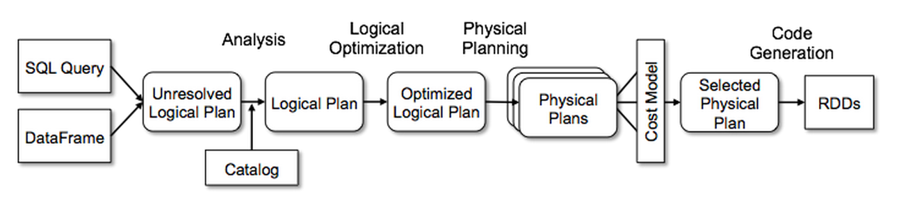
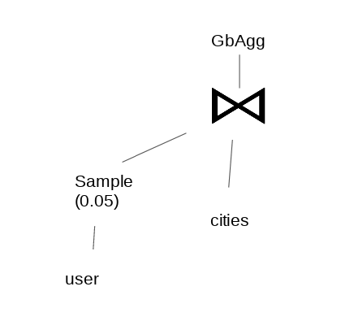

# **Sommelier**


    
***We are thrilled to present a new approach to analyze Big Data by accessing the smallest quantity of data possible: the Sommelier Sampling.***

## ***INTRODUCTION:***


    
    
With the raise of Big Data and Analytics, the demand for optimization on the way data is handled is growing every day. Executing complex data analytics queries on ever increasing datasets costs time and money, access to data will become more expensive and will induce to memory walls, being sampling techniques the perfect solution.   

Sampling is a powerful but also feared technique for approximating query answers. The main issue about sampling in large data platforms is that it does not offer sizable savings with only a small effect on the answer quality and the error estimation is still challenging.  

Some experts have written reports to demonstrate its benefits, along with rules and calculations  to measure error estimation. From this point, we propose to study and implement an open-sourced version of such studies. 


------


## State of the art
In our research process, we identified two solutions that perform state of the art query sampling. First, we will discuss the Microsoft’s Quickr system to perform sampling queries on Big Data. Then, we will present BlinkDB, a query engine to run distributed approximate SQL queries, which is being developed jointly by the MIT and UC Berkley. 

Additionally, we will review the research that has already been made to perform approximate queries in Spark, although so far, we have only found implementations using RDD and nothing open-sourced. 

 
 
## QuickR: Lazily Approximating Complex AdHoc Queries in Big Data Clusters 


    
https://www.microsoft.com/en-us/research/wp-content/uploads/2016/06/quickr-2.pdf 

In the year 2016, Microsoft presented a system called QuickR that approximates the answer to complex queries by injecting samplers on the fly and without requiring pre-sampled data. Through a cost-based optimizer, they generate query plans with appropriate sample operators at the most adequate location, providing also an accuracy analysis to not miss any little group. The results show that QuickR improves substantially the performance in a large segment of TPC-DS benchmark queries, using a 2x fewer resources in the cluster and with a mean error of only the 10% in aggregations.  


How did they accomplish that? 

By analyzing the queries and taking into account the statistics of the tables, the system decides whether to sample the data or not, and which sampling technique will deliver the most accurate answer. In the paper, they describe the implementation of three different types of sampling techniques, which will be described with examples in the next section: 

- **Uniform**: All elements have the same probability to be selected. 

- **Universe**: Picks a p fraction of the values of the columns in a given set; all rows with such value are passed by this sampler. 

- **Distinct**: Sampling technique that guarantees all groups in the data  are selected at least a determinate number of times.  

They also implement logical optimization rules to propagate the operator through projections and joins (left, right, both or none of them) to retrieve less data in early stages of the query. The system also allows exploring confidence intervals and other estimators of individual operators after the query completes, as part of an accuracy analysis. 

An analysis of approximability of big data queries shows: 

1. Distribution of queries over input datasets is heavy-tailed. Individual queries use many columns and different combinations of columns (in projection/filtering) such that the additional storage space required to store samples can be prohibitively large. 

2. Queries typically have aggregation operators, and output results are by many orders of magnitude smaller than inputs, so they are approximable. 

3. Several factors hinder approximability: queries use a diverse set of columns requiring extensive stratification. Many queries join large input relations. 

4. Queries are deep, involving multiple effective passes over data including network shuffles. 

------
## Experience with Approximating Queries in Microsoft’s Production Big-Data Clusters 

    
    
https://www.microsoft.com/en-us/research/uploads/prod/2019/04/p698-kandula.pdf  

Three years later than the previous paper talking about the QuickR solution, the error approximation and pushdown rules, they published their overall experience (over tens of production clusters) on using this type of query time sampling. Just to remember, the two main steps of this technique are:  

1. Users add sampling operators on the query 

2. The Query Optimizer transforms the predicate pushing down the operators while ensuring the accuracy is still intact  

Their findings indicate that QuickR proved to be very valuable in production environments. In table 1, we provide a résumé of the conclusions, but you can compare the charts and results by following the link to the published paper.  


- All three samplers are used evenly 

- One third of the queries use multiple sample operators.  

<p align="center">
    
</p>


- The median processing rate for samplers is over 100MBps. Over 95% of samplers process input at over 100Mbps (low processing rate means very little data!) 

- A significant majority of the samplers doesn’t have memory footprint 

- Distinct sampler has more complex implementation (it had to track groups that had a large number of rows) 

- About 30% of the samplers picks less than 1% fraction of input. Many samplers also pick 10% (this was the recommended setting of the manual they provided)  

- Fewer than 10% of the samplers use a probability assignment above 0.25 

- 80% of universe samples are over a single column 

- The 90% of the input column sets of distinct is between 1 and 6 

- Among the jobs that use samplers, only 2% never had to be re-executed. And over the 80% repeat at least 100x each.  


The results on the TPC-H Benchmark (http://www.tpc.org/tpc_documents_current_versions/pdf/tpc-h_v2.18.0.pdf) showed that: 


- Roughly 8 of 22 queries are unsampled 

- Queries 5, 7, 8 and 9 improve substantially their processing cost  

------
## BlinkDB 

    
https://sameeragarwal.github.io/blinkdb_eurosys13.pdf 

BlinkDB proposes and implements an approximate query engine for running interactive SQL queries on large volumes of data. It supports ad-hoc queries with error and response time constraints. 

BlinkDB implements a multi-dimensional sampling strategy that builds and maitnains a variety of samples. Also, it implements a run-time dynamic sample selection strategy that uses parts of a sample to estimate query selectivity and chooses the best samples for satisfying query constraints.  

It handles a variety of queries with diverse error and time constraints. 2s on 17 TB of data with 90-98% accuracy. 


<p align="center">
    
   
</p>
<br/>


To store differently stratified samples, a-priori storage techniques typically use sample storage of 1x to 10x the size of the input. We’ve seen in a benchmark that the smallest input set used by 20% of queries is 3PB. Hence, assuming input popularity can be predicted perfectly, covering 20% of queries will require between 3PB and 30PB of a-priori samples. Such a large sample set is already a substantial fraction of the total input size (120PB).  

------
## Approximation error bounds in Spark 

https://arxiv.org/pdf/1812.01823.pdf 

This is the single implementation that we have found, not as an open source project, that involves the Spark engine. The publication goes back to 2019 and presents the challenge of Error Bound Estimation. 
<br/>


Data processing pipelines often transform the input dataset in complex ways before aggregating values. This framework  permits sampling at arbitrary points (same as the Microsoft one) before aggregation. Internally constructs a data provenance tree to maintain information about how transformations are clustering data output items to be aggregated. Later on, uses this structure along with multistage sampling theories to compute the approximate aggregate values and corresponding error bounds. Finally, an algorithm is triggered to accomplish the user specifications through dynamic sampling percentages. 

There’s no reference nor knowledge that Spark SQL is being used in this system. They only included some new functions on RDDs  (to support partition/input data item sampling and aggregateByKeyMultiStage function), modifying either the core or using an external package to create the whole logic of it.  

In the end, the evaluation shows that:  

- Multi-stage sampling significantly reduces execution time 

- Partition sampling can lead to larger exec time savings (dropping partitions eliminates overhead) 

- Significant fractions of the keys can be lost. Sampling rates for Word Co-Ocurrence (text mining application) reduce execution time by 40% at the expense of losing 25% of the keys. For these lost keys, the grouping count was of 0.08 * 10 –4 

- Relatively high partition sampling rates (e.g 50%)  can impact error bounds for more rare keys  (increasing the number of lost keys)    


------
## Spark SQL 

https://databricks.com/blog/2015/04/13/deep-dive-into-spark-sqls-catalyst-optimizer.html


Understanding the way that Spark SQL works nowadays is key to go further in this investigation. What is already implemented? How  can it be optimized? Is it  mandatory to change the base code? 

The newest component in Apache Spark SQL was Catalyst Optimizer, which is a Query Optimizer that improves executions by applying a series of logical and physical strategies, so the user does not have to worry about techniques such as pushdown operators or behavior of the system. 

The pipeline goes as follow: 
<center>   
    
</center> 
    


Catalyst’s general tree transformation framework it's used in four phases, as shown above: (1) analyzing a logical plan to resolve references, (2) logical plan optimization, (3) physical planning, and (4) code generation to compile parts of the query to Java bytecode. 

The two main elements for mantaining coherence between these stages are:
- Trees: The main data type in Catalyst is a tree composed of node objets. They are immutable and can be manipulated using functional transformations. They can be seen as the materialization of a Logical Plan, Optimized Logical Plan and Physical Plan. 
- Rules: Trees can be manipulated using rules, which are functions from a tree to another tree. The most common approach is to use a set of pattern matching functions that find and replace subtrees with a specific structure.


### **Sample Operator**


The keyword that is used to perform samples is <b>TABLESAMPLE (X PERCENT/ROWS)</b>:  It can be expressed in terms of either a percentage (must be between 0 and 100) or a fixed number of input rows. In the end it will return an approximate number of rows based upon the input criteria.  
    
After the query is analyzed, the TABLESAMPLE is transformed to a logical Sample operator, that includes more parameters with default values such as:
- <i>lowerBound</i>: Lower-bound of the sampling probability (usually 0.0)
- <i>upperBound</i>: Upper-bound of the sampling probability. The expected fraction sampled will be ub - lb.
- <i>withReplacement</i>: wether to take out the elements from the orirignal dataset that appears in the sample or mantain them. False as default
- <i>seed</i>: a seed for sampling. Default at random
    
After setting the Tree, the Sample is no longer optimized logically, and the execution would sample at random following a Bernoulli trial on partitioning the data if it's set withoutReplacement or a Poisson distribution (normal) when you don't lose any element. 
    
<br/>
Right now, the spark sample implementation does not allow the logical operator to be pushed down in the Logical Plan Tree. The next Figure shows a simple Logical Plan Tree of a Join operation with a Tablesample at the end of it: 

<p align="center">
    
</p>

Of course the user can acknowledge the distribution and sizes of the tables and change the location of the operator in the query, but to make things even easier for them and move the computation closer to datasources, we want to integrate pushdown for the sampler operator. In this case the sampler would be performed at the largest table (user). 
 
<p align="center">
    
</p>


Here's a more practical example of the Spark behaviour when you use the TABLESAMPLE expression on a query. 


```python
(1 to 10).map(x => ("a", x)).toDS.createOrReplaceTempView("ta")
(1 to 10).map(x => ("b", x)).toDS.createOrReplaceTempView("tb")

spark.sql(s"""
            SELECT *
            FROM (
                SELECT * 
                FROM ta 
                JOIN tb 
                    ON ta._2 == tb._2
                )
            TABLESAMPLE(1 PERCENT)""").explain(true)
```

    == Parsed Logical Plan ==
    'Project [*]
    +- 'SubqueryAlias `__auto_generated_subquery_name`
       +- 'Sample 0.0, 0.01, false, 448
          +- 'Project [*]
             +- 'Join Inner, ('ta._2 = 'tb._2)
                :- 'UnresolvedRelation `ta`
                +- 'UnresolvedRelation `tb`
    
    == Analyzed Logical Plan ==
    _1: string, _2: int, _1: string, _2: int
    Project [_1#77, _2#78, _1#82, _2#83]
    +- SubqueryAlias `__auto_generated_subquery_name`
       +- Sample 0.0, 0.01, false, 448
          +- Project [_1#77, _2#78, _1#82, _2#83]
             +- Join Inner, (_2#78 = _2#83)
                :- SubqueryAlias `ta`
                :  +- LocalRelation [_1#77, _2#78]
                +- SubqueryAlias `tb`
                   +- LocalRelation [_1#82, _2#83]
    
    == Optimized Logical Plan ==
    Sample 0.0, 0.01, false, 448
    +- Join Inner, (_2#78 = _2#83)
       :- LocalRelation [_1#77, _2#78]
       +- LocalRelation [_1#82, _2#83]
    
    == Physical Plan ==
    *(1) Sample 0.0, 0.01, false, 448
    +- *(1) BroadcastHashJoin [_2#78], [_2#83], Inner, BuildRight
       :- LocalTableScan [_1#77, _2#78]
       +- BroadcastExchange HashedRelationBroadcastMode(List(cast(input[1, int, false] as bigint)))
          +- LocalTableScan [_1#82, _2#83]


As you can see, the Sample operation appears at the top of the query tree plan, meaning that would be executed 
after the join.
It always mantains the position on the tree, it's not pushed down through any operator. 


------
## Sampling types

In this notebook we present a few examples to better understand the different types of samples that exist and when they should be used.
We create synthetic datasets, normally distributed data and skewed data affects query results when sample techniques are used. We will see how the cardinality between data is key. 
<br/>


The sampling types used for a query will vary depending on the data, data with normal distribution allows to use uniform sample. Skewed data, usually means that we need to `groupBy` the data so that we have at least some rows from every group in the data. We will use universe sample when two tables have the same size and are “row aligned”. 


Imagine we have two tables on our system: <br/>
<br/>

```sql 
    CREATE TABLE user ( 
        user_id LONG,  
        city_id LONG 
    ) 
    PRIMARY KEY user_id 
```
<br/>
    
```sql
    CREATE TABLE cities ( 
        city_id LONG, 
        name TEXT, 
        cash INT
    ) 
    PRIMARY KEY city_id 
```
  
<br/>
    
User_id and city_id are the identifiers for both tables, while Cash means the salary for that city. In our test we will do a join operation followed by a sum of the money, grouping by cities to show the differences among distributions and why is best to use one sample or another depending on the case. 
    


```python
case class User(user_id: Int, city_id: Long)
case class Cities(city_id: Long, name: String, cash: Int = 100)
def randomizeCity= scala.util.Random.nextInt(5).toLong +1
```


    defined class User
    defined class Cities
    randomizeCity: Long


------
## ***Uniform sample***

Also known as Simple Random Sampling(SRS), it is assumed that the population is independent and identically distributed (i.i.d). The sample size required to reach a prespecified precision is based on the dispersion variance of the population and the survey precision required. Then the sample units are chosen from the population independently with equal probability, and inferences are conducted using the sample. I.e. We will use this kind of sample when every row from a table has the same probability of being selected. 

<p align="center">
    
</p>

```python
(1 to 100000).map(x => User(x, randomizeCity)).toDS.createOrReplaceTempView("users")
(1 to 5).map(x => Cities(x, "a")).toDS.createOrReplaceTempView("cities")
```


```python
val query = spark.sql(s"""
                SELECT users.city_id, 
                       sum(cities.cash) AS res
                FROM users 
                JOIN cities 
                    ON users.city_id == cities.city_id
                GROUP BY users.city_id""")

```


    query: org.apache.spark.sql.DataFrame = [city_id: bigint, res: bigint]


```python
val uniform_sample =  spark.sql(s"""
                SELECT users.city_id, 
                       sum(cities.cash*100) AS res_sample
                FROM users TABLESAMPLE(1 PERCENT) 
                JOIN cities 
                    ON users.city_id == cities.city_id
                GROUP BY users.city_id""")
```


    uniform_sample: org.apache.spark.sql.DataFrame = [city_id: bigint, res_sample: bigint]


```python
query.show()
```

    +-------+-------+
    |city_id|    res|
    +-------+-------+
    |      5|1994000|
    |      1|2016700|
    |      3|1979600|
    |      2|1986000|
    |      4|2023700|
    +-------+-------+
    


```python
uniform_sample.show()
```

    +-------+----------+
    |city_id|res_sample|
    +-------+----------+
    |      5|   1850000|
    |      1|   2090000|
    |      3|   2330000|
    |      2|   1870000|
    |      4|   1980000|
    +-------+----------+
    


```python
query.createOrReplaceTempView("query")
uniform_sample.createOrReplaceTempView("sample")
```


```python
val error = spark.sql(s"""
            SELECT query.city_id, 
                   abs(res - res_sample)/res*100 AS error 
            FROM query 
            JOIN sample 
                ON query.city_id == sample.city_id
""")
```


    error: org.apache.spark.sql.DataFrame = [city_id: bigint, error: double]


```python
error.show()
```

    +-------+-----------------+
    |city_id|            error|
    +-------+-----------------+
    |      5|7.221664994984955|
    |      1|3.634650666931125|
    |      3|17.70054556476056|
    |      2|5.840886203423968|
    |      4|2.159410979888323|
    +-------+-----------------+
    


------
## ***Distinct sample***
 
The uniform sample is simple but it has some issues that limit it from being used widely. Queries with group-by such as `SELECT X, SUM(Y), GROUP BY X` can miss groups in the answer, especially those corresponding to values of X that have low support. For such queries, we must use a different kind of sample, such as the distinct sampler which intuitively guarantees that at least a certain number of rows pass per distinct combination of values of a given column set. The distinct sample also helps when aggregates have high skew. When we have skewed data, few rows can contain high values (e.g revenue of a company) in a way that, for a given query that aggregates such values, these rows are crucial to obtain approximate results and hence they should have a higher probability of being selected. 

<p align="center">
    
</p>


```python
val users_data_1 = (1 to 300).map(x => User(x, randomizeCity)).toDS
val users_data_2 = (301 to 100000).map(x => User(x, 5)).toDS

users_data_1.union(users_data_2).createOrReplaceTempView("users")
(1 to 6).map(x => Cities(x, "a")).toDS.createOrReplaceTempView("cities")
```


    users_data_1: org.apache.spark.sql.Dataset[User] = [user_id: int, city_id: bigint]
    users_data_2: org.apache.spark.sql.Dataset[User] = [user_id: int, city_id: bigint]


```python
val query_skewed = spark.sql(s"""
                SELECT users.city_id, 
                       sum(cities.cash) AS res
                FROM users 
                JOIN cities 
                    ON users.city_id == cities.city_id
                GROUP BY users.city_id""")
```


    query_skewed: org.apache.spark.sql.DataFrame = [city_id: bigint, res: bigint]


```python
query_skewed.show()
```

<br/> 

What happens if we try to perform a uniform sample on users table now that the table is <b>skewed</b>?

<br/> 


```python
val uniform_sample_skewed =  spark.sql(s"""
                SELECT users.city_id, 
                       sum(cities.cash*100) AS res_sample
                FROM users TABLESAMPLE(1 PERCENT) 
                JOIN cities 
                    ON users.city_id == cities.city_id
                GROUP BY users.city_id""")
```

    +-------+-------+
    |city_id|    res|
    +-------+-------+
    |      5|9976800|
    |      1|   5600|
    |      3|   6500|
    |      2|   5900|
    |      4|   5200|
    +-------+-------+
    


    uniform_sample_skewed: org.apache.spark.sql.DataFrame = [city_id: bigint, res_sample: bigint]


```python
uniform_sample_skewed.show()
```

    +-------+----------+
    |city_id|res_sample|
    +-------+----------+
    |      5|   9830000|
    |      3|     10000|
    |      4|     10000|
    +-------+----------+
    


Some groups in the data are <b>missing</b>! Moreover, we obtain <b>high error</b> in the output result.
<br/>


```python
query_skewed.createOrReplaceTempView("query")
uniform_sample_skewed.createOrReplaceTempView("sample")
```


```python
val error = spark.sql(s"""
            SELECT query.city_id, 
                   abs(res - res_sample)/res*100 AS error 
            FROM query 
            JOIN sample 
                ON query.city_id == sample.city_id
""")
```


    error: org.apache.spark.sql.DataFrame = [city_id: bigint, error: double]


```python
error.show()
```

    +-------+------------------+
    |city_id|             error|
    +-------+------------------+
    |      5|1.4714136797369899|
    |      3| 53.84615384615385|
    |      4|  92.3076923076923|
    +-------+------------------+
    


Now we are going to take into account the groups in the data, we <b>groupBy</b> city to take at least some rows from each group.
<br/>


```python
val stratified = spark.sql(s"""
                SELECT *, 
                       IF((count*0.01) >= 3,0.01, cast(1.0 as double)) AS p
                FROM 
                (
                    SELECT city_id, COUNT(*) AS count 
                    FROM users 
                    GROUP BY city_id
                    
                )""")
```


    stratified: org.apache.spark.sql.DataFrame = [city_id: bigint, count: bigint ... 1 more field]


```python
stratified.createOrReplaceTempView("stratified")
```


```python
val users_sample = spark.sql(s"""
                SELECT user_id, users.city_id, p
                FROM users 
                JOIN stratified 
                    ON stratified.city_id == users.city_id 
                WHERE RAND() <= p""")


```


    users_sample: org.apache.spark.sql.DataFrame = [user_id: int, city_id: bigint ... 1 more field]


```python
users_sample.createOrReplaceTempView("users_sample")
```

The size of the sample is approximate


```python
val sample_size = users_sample.count.toDouble/users_data_1.union(users_data_2).count

```


    sample_size: Double = 0.01235


```python
val distinct_sample = spark.sql(s"""
                SELECT users_sample.city_id, 
                       sum(cities.cash / p) AS res_sample
                FROM users_sample
                JOIN cities 
                    ON users_sample.city_id == cities.city_id
                GROUP BY users_sample.city_id""")
```


    distinct_sample: org.apache.spark.sql.DataFrame = [city_id: bigint, res_sample: double]


```python
distinct_sample.show()
```

    +-------+----------+
    |city_id|res_sample|
    +-------+----------+
    |      5|   1.003E7|
    |      1|    5600.0|
    |      3|    6500.0|
    |      2|    5900.0|
    |      4|    5200.0|
    +-------+----------+
    


As you can see, we have now obtained a very <b>good result</b>. All the groups are represented and the output error is conceivable.
<br/> 
<br/>


```python
distinct_sample.createOrReplaceTempView("sample")
```


```python
val error = spark.sql(s"""
            SELECT query.city_id, 
                   abs(res - res_sample)/res*100 AS error 
            FROM query 
            JOIN sample 
                ON query.city_id == sample.city_id
""")
```


    error: org.apache.spark.sql.DataFrame = [city_id: bigint, error: double]


```python
error.show()
```

    +-------+------------------+
    |city_id|             error|
    +-------+------------------+
    |      5|0.5332371100954214|
    |      1|               0.0|
    |      3|               0.0|
    |      2|               0.0|
    |      4|               0.0|
    +-------+------------------+
    


------
## ***Universe sample***


When two large tables are joined with a shared key, uniform sampling both the join inputs is not useful. Distinct sampling both the inputs has limited gains if the join keys have many columns and hence, many distinct values. Universe sample allows to sample the inputs of joins. It picks a p fraction of the values of the columns in a set (two tables of the same size). E.g. select all rows with module 500. 
 
<p align="center">
    
</p>


```python

(1 to 500000).map(x => User(x, x)).toDF().createOrReplaceTempView("users")
(1 to 500000).map(x => Cities(x, "a")).toDF().createOrReplaceTempView("cities")

```


```python
val query = spark.sql(s"""
                    SELECT users.city_id, sum(cities.cash) AS res
                    FROM users 
                    JOIN cities 
                        ON users.city_id == cities.city_id
                    GROUP BY users.city_id""")

```


    query: org.apache.spark.sql.DataFrame = [city_id: bigint, res: bigint]


```python


val sampling_after_join = spark.sql(s"""
                    SELECT city_id,
                           sum(cash) AS res_sample
                    FROM (
                        SELECT users.city_id, cities.cash 
                        FROM users 
                        JOIN cities 
                            ON users.city_id == cities.city_id
                    ) TABLESAMPLE (1 PERCENT)
                    GROUP BY city_id
                    """)

```


    sampling_after_join: org.apache.spark.sql.DataFrame = [city_id: bigint, res_sample: bigint]


```python
%%time
query.show(5)
```

    +-------+---+
    |city_id|res|
    +-------+---+
    |     26|100|
    |     29|100|
    |    474|100|
    |    964|100|
    |   1677|100|
    +-------+---+
    only showing top 5 rows
    
    Time: 10.25024151802063 seconds.
    


```python
%%time
sampling_after_join.show(5)
```

    +-------+----------+
    |city_id|res_sample|
    +-------+----------+
    |  17043|       100|
    |  29824|       100|
    |  37261|       100|
    |  38510|       100|
    |  75411|       100|
    +-------+----------+
    only showing top 5 rows
    
    Time: 9.633416175842285 seconds.
    


```python
val users_sample = spark.sql(s"""SELECT * FROM users WHERE city_id % 500 == 0""")
users_sample.createOrReplaceTempView("users_sample")

val cities_sample = spark.sql(s"""SELECT * FROM cities WHERE city_id % 500 == 0""")
cities_sample.createOrReplaceTempView("cities_sample")


val universe_sample = spark.sql(s"""
                    SELECT users_sample.city_id,
                           sum(cities_sample.cash) AS res_sample
                    FROM users_sample 
                    JOIN cities_sample 
                        ON users_sample.city_id == cities_sample.city_id
                    GROUP BY users_sample.city_id""")
```


    users_sample: org.apache.spark.sql.DataFrame = [user_id: int, city_id: bigint]
    cities_sample: org.apache.spark.sql.DataFrame = [city_id: bigint, name: string ... 1 more field]
    universe_sample: org.apache.spark.sql.DataFrame = [city_id: bigint, res_sample: bigint]


```python
%%time
universe_sample.show(5)
```

    +-------+----------+
    |city_id|res_sample|
    +-------+----------+
    | 265000|       100|
    | 294500|       100|
    | 350000|       100|
    | 372000|       100|
    | 419000|       100|
    +-------+----------+
    only showing top 5 rows
    
    Time: 1.7970502376556396 seconds.
    


There's a notable difference in the time of processing the join on one query and the other, and the same result is obtained (since the cash is the same on every user, but also if the column follows a normal distribution, it wouldn't alterate significantly the result). 

------
## ***MOTIVE:***

## Possible implementations


   
So far, we are discussing two possible implementations. We can directly implement the Microsoft approach, but we are considering a different approach that makes it easier for the user. We are calling it Sommelier. 
    
    
- **The Microsoft way**

The user needs to take into account the weight of the rows when the sample is performed, if the query involves a count or a sum operation, we need to weight the result according to the sample precision. 
<br/>
<br/>
```sql
    SELECT SUM(cities.cash)*weight
    FROM ( 
        SELECT * 
        FROM user, cities 
        WHERE user.city_id == cities.city_id 
    ) 
    TABLESAMPLE (1% TOLERANCE) as weight  
    GROUP BY (cities.city_id) 
    // Could also be TABLESAMPLE (1% PERCENT) as weight 
```
   <br/>

- **Sommelier**

We want to make it easier for the user, in the Sommelier approach the user only needs to add the max error that can be allowed when using samples in the whole query. 

```sql
    SELECT SUM(cities.cash)
    FROM ( 
        SELECT * 
        FROM user, cities
        WHERE user.city_id == cities.city_id 
    )  
    GROUP BY (c.city_id) 
    TABLESAMPLE (1% TOLERANCE) 
```

------
## ***OVERALL SCHEMA:***


Since this project is aiming to modify and/or extend the current implementation of Spark SQL, we want to provide an intuition on the schema.  Our first intention is to develop outside the spark code, since SparkSessionExtension exists. This particular class was launched in Spark 2.2, it is pluggable and extensible and his basic function is let the user add customized extensions to the Catalyst Query Optimizer. The supported customizations include: 

- Custom Parser 

- Custom Analysis Rules (Analyzer Rules and Check Analysis Rules) 

- Custom Logical Rules (Optimizer Rules) 

- Custom Spark Strategies (Planning Strategies) 

- External Catalog Listeners 
    


<p align="center">
    
</p>

We propose an extension of the following components: 

    
- **Parser.**

First things first, we need to include some changes in the predicates to let the user try our new way of sampling. As seen in latest sections, this can appear as a new column w (which maybe doesn’t really need to be detected in the parser, but as a Catalyst Expression), or changing the TABLESAMPLE operator.  

Currently, the last one only supports ROWS and PERCENT as arguments, so the intention is to include a TOLERANCE clause. The detection of the new attribute is a must for triggering the subsequent processes. 

- **New logical operators.**

In order to define different types of sampling, we need to include them in the Logical Plan to become more efficient detecting and optimizing them. The uniform one is already present on the tree as the basic Sample operator, which selects rows following a random distribution.  

Spark would choose between the Universe Sample and Distinct Sample  depending on the characteristics of the tables below and the type of the query the user specifies (use Distinct if they follow a more skewed distribution...) 

- **Logical Optimization Rules.**

Some rules for the above new operators would improve the performance of the sampling by pushing down the sample operator in later stages of the query. We have to be able to detect the presence of Distinct, Universe and Uniform samples and have control over the Logical Plan tree.  

- **Error Estimation**

Before each step of the whole process, we have to check that the user tolerance condition is maintained intact, meaning that a set of stats about the estimated error should be calculated. This would include attributes like selectivity, cardinality and so on.  

<p align="center">
    
</p>


------
## ***DISCUSSION***

We look forward for your feedback! Any project-structure convenience or doubt that you have, make sure to let us know! The issues are open.

Also, if you want to contribute, don't hesitate to contact with us!
    
    
